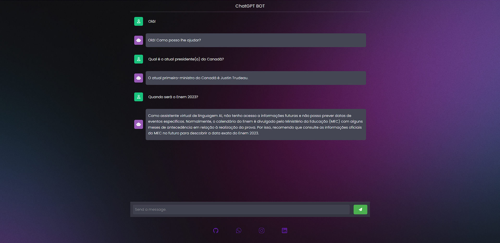
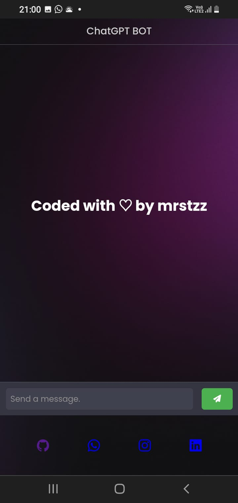

<h1 align="center"> ChatGPT BOT </h1>

  
Project developed for my improvement in HTML | CSS | JS

  <a href="#-technologies">Technologies</a>&nbsp;&nbsp;&nbsp;|&nbsp;&nbsp;&nbsp;
  <a href="#-project">Project</a>&nbsp;&nbsp;&nbsp;|&nbsp;&nbsp;&nbsp;
  <a href="#-testing">Testing</a>&nbsp;&nbsp;&nbsp;|&nbsp;&nbsp;&nbsp;
  <a href="#memo-licence">Licence</a>

  

 

  
  
  
  

## 🚀 Technologies

This project was developed with the follow technologies:

- HTML 
- CSS
- JavaScript

## 💻 Project

The purpose of this project is to be a simple and
functional ChatGPT 

OBS: This chatgpt is from August 2021, that is, real-time information or news will be out of date

## 🔖 Testing

If you want to test it follow [THIS LINK](https://mrstzz.github.io/ChatGPT-BOT/)

## :memo: Licence

This project is lincensed under the MIT license.

---

Made ♥ by mrstzz :wave: [Join the community!](https://discord.gg/VvkJk9UDmV)
